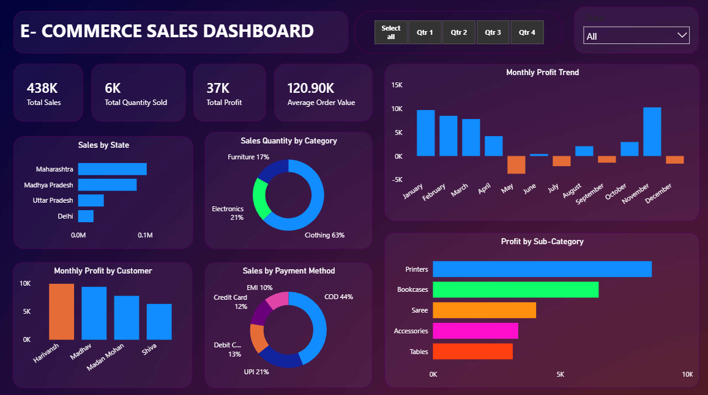

# E-Commerce Sales Dashboard

## Project Overview

This Power BI dashboard analyzes e-commerce sales performance.

## Tools Used

- Power BI
- Excel

## Key Metrics

- Total Sales: 438K
- Total Profit: 37K
- Total Quantity Sold: 6K
- Average Order Value: 120.9K

## Dashboard Preview

